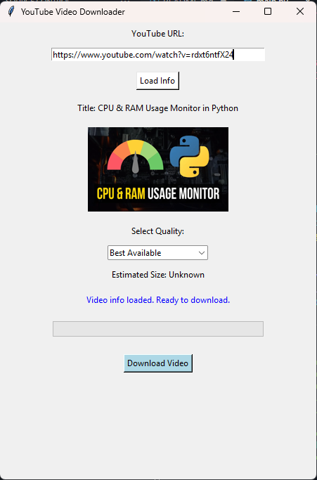

# YouTube Video Downloader 🎥  

A simple desktop app built with **Python, Tkinter, and yt-dlp** that lets you download YouTube videos with ease.  
It comes with a clean interface where you can:  

- Load video info (title + thumbnail).  
- Choose the video quality (Best, 1080p, 720p, 480p, or Audio only).  
- See the **estimated file size** before downloading.  
- Track the download progress with a progress bar.  
- Download without the app freezing (thanks to multithreading).  

---

## ✨ Features  
- ✅ Fetches video title and thumbnail preview.  
- ✅ Lets you pick from multiple quality options.  
- ✅ Shows estimated file size before you start the download.  
- ✅ Progress bar + percentage updates in real time.  
- ✅ Multithreaded – the app won’t freeze during download.  
- ✅ Easy-to-use GUI with Tkinter.  

---

## 📸 Preview  


---

## 🚀 How to Run  

1. Clone or download this repository.  
2. Make sure you have **Python 3.8+** installed.  
3. Install the required dependencies:  

   ```bash
   pip install yt-dlp pillow requests


💡 Future Improvements

Show all available resolutions dynamically instead of fixed options.
Option to download subtitles.
Dark mode UI.